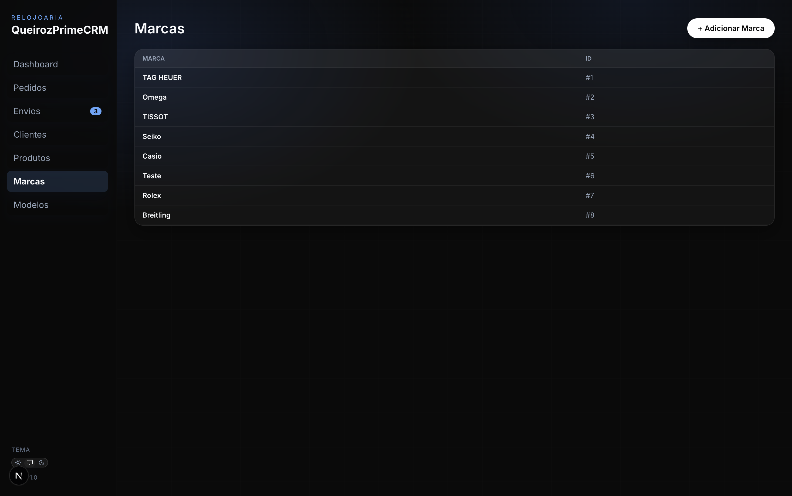

# Watch CRM
CRM fullstack para relojoaria com autenticação, autorização por papéis, cadastros, pedidos, envios e dashboards.

## Stack
- Frontend: Next.js (App Router) + React + TypeScript
- Backend: Laravel 12 (PHP 8.2+)
- Banco: MySQL (via Docker) ou SQLite local (desenvolvimento)

## Autenticação e Acesso
- Login stateful com Laravel Session e cookie HTTP-only
- Proteção CSRF com `GET /api/csrf-cookie` antes do login
- Autorização por papéis (`admin`, `gerente`, `vendedor`)
- Permissões por rota + ownership em módulos com visibilidade por usuário


## Telas do Sistema
### Dashboard


### Pedidos


### Fila de Envios


### Clientes


### Produtos e Estoque


### Marcas


### Modelos


## Estrutura do Projeto
```
watch-crm/
├─ frontend/                  # Next.js (UI/CRM)
│  └─ src/features/crm/        # Core do CRM
│     ├─ CrmApp.tsx            # Container principal + sessão autenticada
│     ├─ api.ts                # CSRF, cookies e chamadas autenticadas
│     ├─ views/                # Telas (Dashboard, Pedidos, Envios, Clientes, Produtos, Login)
│     ├─ ui/                   # Componentes base
│     ├─ types.ts              # Tipos do domínio, auth e permissões
│     └─ helpers.ts            # Cálculos e formatação
├─ backend/                    # Laravel API
│  ├─ app/Http/Controllers/Api # Controllers da API
│  ├─ app/Models               # Models Eloquent + AuditLog
│  ├─ app/Policies             # Policies por ownership
│  ├─ app/Support              # Permissões e auditoria
│  ├─ database/migrations      # Migrations
│  └─ database/seeders         # Seeders
├─ docs/                       # Documentações específicas
├─ docker-compose.yml          # Orquestração Docker (front/back/mysql)
├─ DOCUMENTACAO.md             # Documentação funcional e endpoints
└─ crm-relogios.jsx            # MVP base de referência
```

## Funcionalidades
- Login e sessão autenticada no frontend
- Autorização por papéis e permissões
- Clientes: cadastro e listagem
- Produtos/Estoque: cadastro e listagem
- Pedidos: listagem e detalhes
- Envios: fila de separação e status
- Dashboard: métricas de vendas e performance

## Endpoints Principais
- GET `/api/csrf-cookie`
- POST `/api/login`
- POST `/api/logout`
- GET `/api/me`
- POST `/api/forgot-password`
- POST `/api/reset-password`
- GET `/api/customers`
- POST `/api/customers`
- PUT `/api/customers/{id}`
- PATCH `/api/customers/{id}`
- DELETE `/api/customers/{id}`
- GET `/api/products`
- POST `/api/products`
- PUT `/api/products/{id}`
- PATCH `/api/products/{id}`
- DELETE `/api/products/{id}`
- GET `/api/orders`

## Desenvolvimento
### Backend
- Instalar dependências: `composer install`
- Rodar API: `php artisan serve`
- Rodar migrations e seeders:
  - dentro do ambiente Docker configurado: `php artisan migrate --seed`
  - no host usando o MySQL publicado do Docker: `DB_HOST=127.0.0.1 DB_PORT=3307 php artisan migrate --seed`

### Frontend
- Instalar dependências: `npm install`
- Rodar app: `npm run dev -- -p 4001`
- Base da API: `NEXT_PUBLIC_API_BASE_URL=http://localhost:8000/api`

## Documentação
- Visão geral do sistema: [DOCUMENTACAO.md](DOCUMENTACAO.md)
- Login, autorização, CSRF e troubleshooting: [docs/login-e-autorizacao.md](docs/login-e-autorizacao.md)
