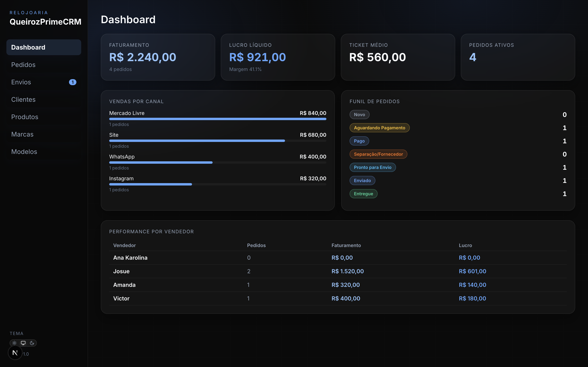
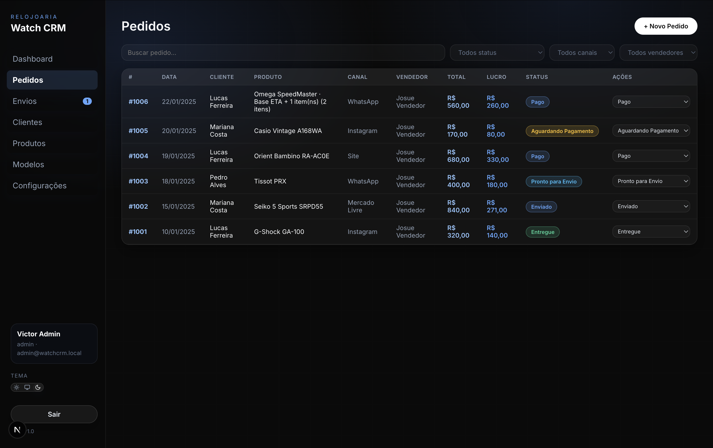
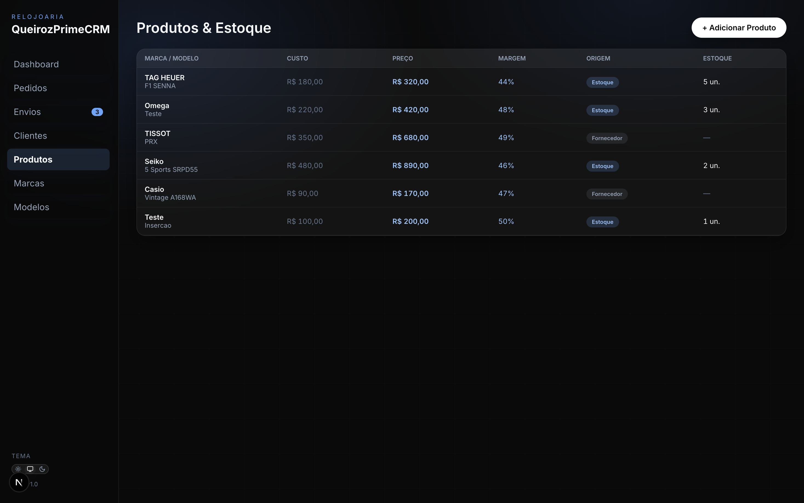
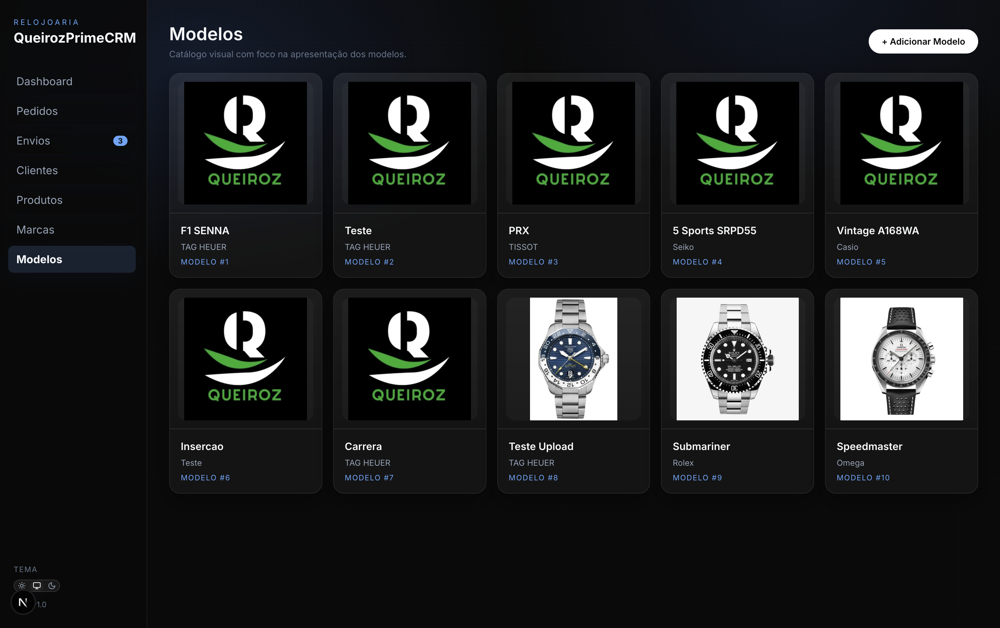
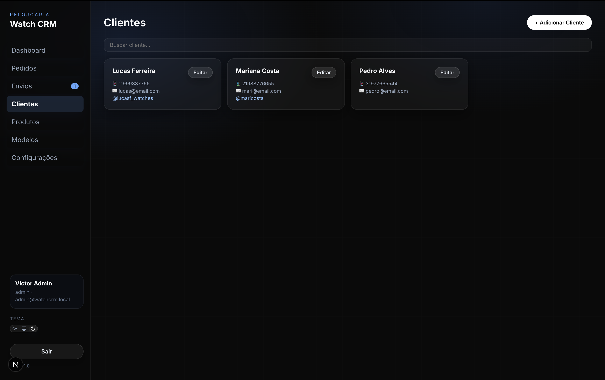
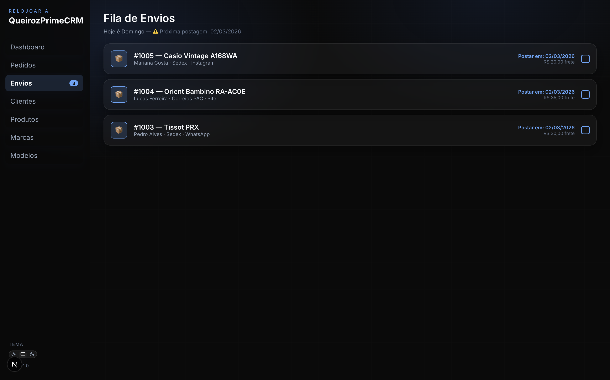
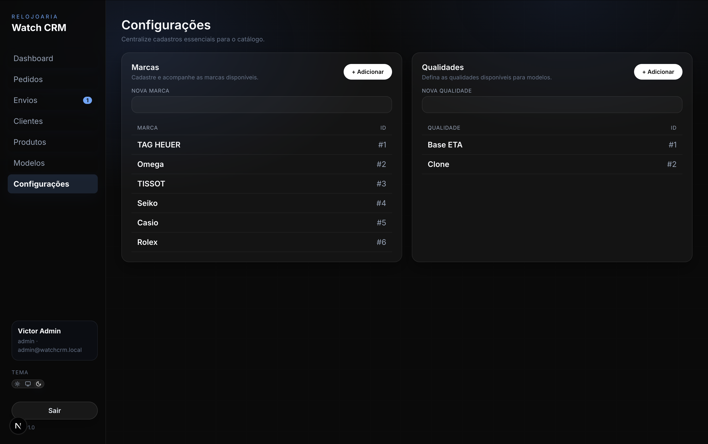
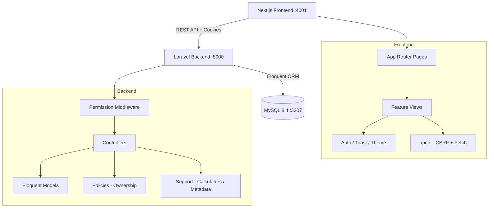
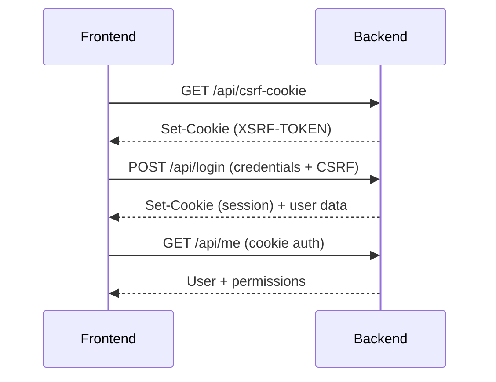

# ⌚ Watch CRM

Sistema fullstack para gestão de relojoaria — catálogo, pedidos, envios, metas de vendas e pós-venda.

> Controle completo da operação da sua loja de relógios, do estoque ao pós-venda.

---

## 📸 Preview

| Dashboard | Pedidos |
|-----------|---------|
|  |  |

| Produtos e Estoque | Modelos |
|---------------------|---------|
|  |  |

| Clientes | Fila de Envios |
|----------|----------------|
|  |  |

| Configurações |
|---------------|
|  |

---

## ❗ Problema

Gerenciar uma relojoaria envolve:
- Controle manual de estoque com alto risco de erro
- Pedidos registrados em planilhas sem rastreabilidade
- Metas de vendas acompanhadas de forma imprecisa
- Pós-venda (garantias, trocas, devoluções) sem padronização
- Falta de visibilidade sobre a performance da equipe

## 💡 Solução

O Watch CRM centraliza toda a operação:
- Catálogo de relógios e caixas com estoque por entrada/origem
- Pedidos com múltiplos itens, preços e descontos por linha
- Metas de vendas configuráveis com progresso em tempo real
- Módulo de pós-venda para garantias, trocas e devoluções
- Dashboard com métricas e visão geral do negócio
- Controle de acesso por papel (admin, gerente, vendedor)

---

## ⚙️ Funcionalidades

- 📊 **Dashboard** — métricas de pedidos e performance da equipe
- 🛒 **Pedidos** — criação com múltiplos itens, quantidade, preço e desconto por linha
- 📦 **Fila de Envios** — acompanhamento de pedidos pendentes de envio
- 👥 **Clientes** — cadastro, edição e busca
- ⌚ **Produtos** — relógios e caixas com controle de estoque por entrada
- 🏷️ **Modelos** — upload de imagem, diferenciação por tipo (WATCH/BOX)
- 🎯 **Metas de Vendas** — escopo empresa ou vendedor, filtros por marca/modelo/tipo, ciclos configuráveis
- 🔄 **Garantias/Trocas/Devoluções** — pós-venda com rastreamento de itens e custos
- 👤 **Usuários** — criação, edição de papel, bloqueio/desbloqueio, reset de senha
- ⚙️ **Configurações** — cadastro de marcas e qualidades
- 🔒 **Auth** — sessão stateful com CSRF, permissões granulares por rota

---

## 🏗️ Arquitetura



### Fluxo de autenticação



---

## 📁 Estrutura do Projeto

```
watch-crm/
├── frontend/                      # Next.js 16 (UI)
│   └── src/
│       ├── app/
│       │   ├── layout.tsx         # Root layout + Providers
│       │   ├── login/page.tsx     # Login standalone
│       │   └── (app)/             # Rotas protegidas
│       │       ├── layout.tsx     # Auth guard + Sidebar
│       │       ├── dashboard/
│       │       ├── pedidos/
│       │       ├── envios/
│       │       ├── clientes/
│       │       ├── produtos/
│       │       ├── modelos/
│       │       ├── metas/
│       │       ├── configuracoes/
│       │       └── usuarios/
│       └── features/crm/
│           ├── api.ts             # CSRF, cookies, chamadas autenticadas
│           ├── types.ts           # Tipos do domínio e permissões
│           ├── helpers.ts         # Formatação e cálculos
│           ├── contexts/          # AuthContext, ToastContext, ThemeContext
│           ├── views/             # Telas e formulários
│           ├── components/        # AppShell, Sidebar, Modal
│           └── ui/                # Componentes base reutilizáveis
│
├── backend/                       # Laravel 12 (API)
│   ├── app/
│   │   ├── Http/
│   │   │   ├── Controllers/Api/   # 10 controllers REST
│   │   │   └── Middleware/        # Permission middleware
│   │   ├── Models/                # 13 Eloquent models
│   │   ├── Policies/              # Ownership checks
│   │   ├── Enums/                 # Product types, statuses
│   │   └── Support/               # Permissions, calculators, audit
│   ├── database/
│   │   ├── migrations/            # 24 migrations
│   │   └── seeders/
│   └── routes/api.php             # Todas as rotas REST
│
├── docs/                          # Documentação por módulo
├── docker-compose.yml             # MySQL + Backend + Frontend
└── DOCUMENTACAO.md                # Doc funcional e técnica
```

---

## 🧰 Stack

### Frontend
- **Next.js 16** — App Router com rotas por arquivo
- **React 19** — Contexts para estado global (sem libs externas)
- **TypeScript 5** — Tipagem estrita no domínio
- **Lucide React** — Ícones
- **CSS Modules** — Estilização isolada por componente

### Backend
- **Laravel 12** — API REST stateful
- **PHP 8.2+** (local) / **PHP 8.4** (Docker)
- **Eloquent ORM** — Models com relationships e scopes
- **Laravel Pint** — Code style

### Banco de Dados
- **MySQL 8.4** — Produção e Docker
- **SQLite** — Desenvolvimento local (opcional)

### Infra
- **Docker Compose** — 3 serviços (mysql, backend, frontend)

---

## 🤔 Decisões Técnicas

### Next.js App Router
- Roteamento por arquivo simplifica a navegação entre módulos
- Cada página carrega dados de forma independente — sem waterfall de requisições
- Layouts aninhados permitem auth guard centralizado no grupo `(app)/`

### Laravel Stateful (não JWT)
- Sessão + cookie HTTP-only elimina gerenciamento de tokens no frontend
- CSRF nativo do Laravel protege contra ataques cross-site
- Mais simples para SPA que fala com API no mesmo domínio/subdomínio

### Permissões granulares
- Middleware `permission:<resource>.<action>` em cada rota
- Mapa de permissões centralizado em `CrmPermissions.php`
- Policies complementam com regras de ownership (ex: vendedor só vê seus próprios clientes)

### Sem state management externo
- Contexts nativos do React (`AuthContext`, `ToastContext`, `ThemeContext`) são suficientes para o escopo
- Evita dependência adicional (Redux, Zustand) sem necessidade real

---

## 🔄 Fluxos Principais

### Criação de pedido
1. Vendedor seleciona cliente e adiciona itens (produto, quantidade, preço, desconto)
2. Frontend envia `POST /api/orders` com array de `order_items`
3. Backend valida permissões, estoque e dados
4. Cria `Order` + `OrderItem` em transação
5. Retorna pedido completo com itens e metadados

### Cálculo de progresso de meta
1. Meta define escopo (empresa ou vendedor), filtros de catálogo e intervalo de tempo
2. `GoalProgressCalculator` consulta `order_items` no período ativo
3. Filtra por marca, modelo e tipo de produto conforme configuração da meta
4. Retorna percentual de progresso atualizado em tempo real

### Autenticação
1. Frontend chama `GET /api/csrf-cookie` para obter token CSRF
2. `POST /api/login` com credenciais + cookie CSRF
3. Backend cria sessão e retorna dados do usuário + permissões
4. Frontend armazena em `AuthContext` e renderiza rotas permitidas

---

## 🗃️ Banco de Dados

### Principais entidades

| Entidade | Descrição |
|----------|-----------|
| `users` | Usuários com role (admin, gerente, vendedor) |
| `customers` | Clientes com endereço e vínculo ao vendedor |
| `products` | Produtos com estoque, marca, modelo e qualidade |
| `orders` | Pedidos com vendedor e criador |
| `order_items` | Itens do pedido (qtd, preço, desconto) |
| `brands` | Marcas de relógio |
| `models` | Modelos com imagem e tipo (WATCH/BOX) |
| `qualities` | Qualidades (material, acabamento) |
| `goals` | Metas de vendas com escopo e filtros |
| `goal_intervals` | Intervalos de período da meta |
| `product_returns` | Garantias, trocas e devoluções |
| `return_items` | Itens da devolução |
| `audit_logs` | Log de auditoria de ações |

### Relacionamentos principais
- `User` → `Order` (1:N) — vendedor
- `Order` → `OrderItem` (1:N) — itens do pedido
- `Product` → `Brand`, `WatchModel`, `Quality` (N:1)
- `Goal` → `GoalInterval` (1:N) — períodos da meta
- `ProductReturn` → `ReturnItem` (1:N) — itens da devolução
- `Customer` → `User` (N:1) — vendedor responsável

---

## 🚀 Como Rodar

### Docker (recomendado)

```bash
docker compose up --build
```

| Serviço  | URL                           |
|----------|-------------------------------|
| Frontend | http://localhost:4001          |
| Backend  | http://localhost:8000/api      |
| MySQL    | localhost:3307                 |

```bash
# Parar e limpar containers
docker compose down --remove-orphans
```

### Desenvolvimento local

#### Backend
```bash
cd backend
composer install
php artisan serve                              # API em :8000

# Migrations (usando MySQL do Docker)
DB_HOST=127.0.0.1 DB_PORT=3307 php artisan migrate --seed

# Testes e lint
php artisan test
./vendor/bin/pint
```

#### Frontend
```bash
cd frontend
npm install
NEXT_PUBLIC_API_BASE_URL=http://localhost:8000/api npm run dev -- -p 4001
```

---

## 🛣️ Roadmap

- [x] Dashboard com métricas
- [x] CRUD de clientes, produtos, modelos
- [x] Pedidos com múltiplos itens
- [x] Fila de envios
- [x] Metas de vendas com progresso em tempo real
- [x] Gerenciamento de usuários e permissões
- [x] Módulo de garantias/trocas/devoluções
- [ ] Relatórios exportáveis (PDF/CSV)
- [ ] Notificações em tempo real
- [ ] App mobile

---

## 📚 Documentação

| Documento | Descrição |
|-----------|-----------|
| [DOCUMENTACAO.md](DOCUMENTACAO.md) | Visão geral técnica e funcional |
| [Login e Autorização](docs/login-e-autorizacao.md) | Auth, CSRF e troubleshooting |
| [Metas](docs/metas.md) | Banco, endpoints e progresso |
| [Garantias](docs/garantias.md) | Módulo de pós-venda |

---

## 👨‍💻 Autor

**Victor Sena**
Desenvolvedor Fullstack
