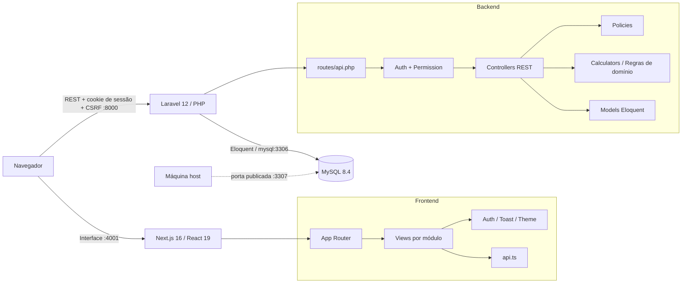
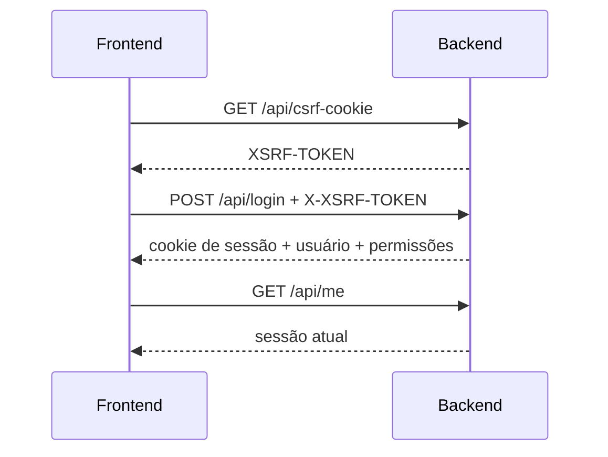

# ⌚ Watch CRM

Sistema fullstack de gestão para relojoaria, cobrindo catálogo e estoque, clientes, pedidos, pagamentos, envios, metas, comissões, despesas e pós-venda.

> Da entrada do produto ao relacionamento após a venda, com visão operacional e financeira por perfil de acesso.

---

## Visão Geral

O Watch CRM centraliza a operação de uma loja de relógios em uma aplicação web com:

- catálogo organizado por marca, modelo, categoria e qualidade;
- estoque separado entre disponibilidade local e fornecedor;
- pedidos multi-item com preços, descontos, custos e confirmação de pagamento;
- dashboard financeiro-operacional com filtros por período e visão adequada ao papel do usuário;
- fila de postagem calculada a partir dos dias configurados;
- metas empresariais e individuais;
- comissões, despesas e avaliação financeira do estoque;
- garantias, trocas e devoluções com histórico de status;
- lista de espera e insights de relacionamento com clientes;
- autenticação stateful, CSRF, permissões por rota e regras de ownership.

---

## Funcionalidades

### Operação comercial

- **Dashboard** — faturamento, ticket médio, lucro das vendas, resultado líquido, conversão de pagamento, pedidos ativos, valores pendentes, evolução, categorias, canais, metas e próximos envios.
- **Pedidos** — criação e edição multi-item, preços por forma de pagamento, desconto por linha, confirmação e expiração de pagamento, filtros e paginação server-side.
- **Clientes** — cadastro, endereço, busca, histórico de pedidos e garantias, indicadores de compra, possível recompra e notas imutáveis de atrito.
- **Produtos e estoque** — custo, preço padrão, preços para PIX/cartão, comissão por unidade, origem `IN_STOCK`/`SUPPLIER` e adição de quantidade.
- **Modelos e catálogo** — marcas, categorias cadastráveis, qualidade condicional por categoria e upload de imagem.
- **Lista de espera** — acompanhamento de interesse por produto, vínculo opcional com pedido e estados `Pendente`, `Avisado`, `Convertido` e `Encerrado`.

### Financeiro e gestão

- **Metas de vendas** — escopo empresa ou usuário, cálculo por valor ou quantidade, filtros de catálogo e ciclos mensal, trimestral, semestral ou anual.
- **Comissões** — projeção por vendedor, valores pagos e pendentes e conciliação das linhas de venda.
- **Despesas gerais** — CRUD, filtros por período/categoria e total agregado sobre todo o filtro.
- **Avaliação de estoque** — custo total e potencial de faturamento do estoque atual.
- **Permissões financeiras** — lucro, resultado, despesas, comissões de terceiros e avaliação financeira são filtrados conforme o papel.

### Envio e pós-venda

- **Agenda de postagem** — dias da semana configuráveis e cálculo da próxima data de envio.
- **Fila de envios** — pedidos pagos aguardando postagem, com paginação, indicação de atraso/prontidão e atualização do envio em modal.
- **Garantias, trocas e devoluções** — itens, custos, reembolso, rastreio de retorno/reenvio, janela de garantia, máquina de estados e histórico de transições.

### Plataforma

- **Usuários** — criação, alteração de papel, bloqueio/desbloqueio e redefinição de senha.
- **Resumo inteligente** — seleção de fatos operacionais via OpenAI, sem envio de PII, com cache, rate limit, fallback isolado do dashboard e card recolhível.
- **Alertas operacionais** — alertas determinísticos de pagamento, conversão e metas, independentes do provedor de IA.
- **Experiência responsiva** — tema claro/escuro/sistema, navegação protegida, tabelas adaptáveis, paginação e seletores pesquisáveis sob demanda.

---

## Papéis e Autorização

| Papel | Escopo principal |
|---|---|
| `owner` | Acesso completo; também pode ser selecionado como vendedor em pedidos e metas. |
| `admin` | Acesso completo à operação, financeiro, usuários e integração de IA. |
| `gerente` | Gestão operacional, catálogo, pedidos, metas, configurações e usuários; confirma pagamento de pedido. Sem relatórios financeiros sensíveis, comissões, despesas, IA nem aprovação de reembolso. |
| `vendedor` | Leitura dos próprios dados operacionais, dashboard e própria comissão; cria e atualiza as próprias entradas da lista de espera. No pós-venda, vê apenas ocorrências de pedido próprio, criadas por ele ou atribuídas a ele. Não cria nem edita pedidos. |
| `garantia` | Leitura de clientes, produtos, modelos e envios; cria e atualiza registros de pós-venda, com acesso à fila completa de ocorrências. Lança custos operacionais da devolução, mas não define valor de reembolso nem aprova reembolso. |

As permissões são verificadas pelo middleware `permission:*`. Policies complementam o controle com ownership, como o escopo de clientes, pedidos, metas, lista de espera e pós-venda.

---

## Arquitetura


```mermaid
flowchart LR
    Browser["Navegador"] -->|"Interface :4001"| Frontend["Next.js 16 / React 19"]
    Browser -->|"REST + cookie de sessão + CSRF :8000"| Backend["Laravel 12 / PHP"]
    Backend -->|"Eloquent / mysql:3306"| Database[("MySQL 8.4")]
    Host["Máquina host"] -.->|"porta publicada :3307"| Database

    subgraph FrontendApp["Frontend"]
        Pages["App Router"] --> Views["Views por módulo"]
        Views --> Contexts["Auth / Toast / Theme"]
        Views --> ApiLayer["api.ts"]
    end

    subgraph BackendApp["Backend"]
        Routes["routes/api.php"] --> Middleware["Auth + Permission"]
        Middleware --> Controllers["Controllers REST"]
        Controllers --> Policies["Policies"]
        Controllers --> Support["Calculators / Regras de domínio"]
        Controllers --> Models["Models Eloquent"]
    end

    Frontend --> Pages
    Backend --> Routes
```

### Autenticação


```mermaid
sequenceDiagram
    participant F as Frontend
    participant B as Backend

    F->>B: GET /api/csrf-cookie
    B-->>F: XSRF-TOKEN
    F->>B: POST /api/login + X-XSRF-TOKEN
    B-->>F: cookie de sessão + usuário + permissões
    F->>B: GET /api/me
    B-->>F: sessão atual
```

A autenticação é stateful e não utiliza JWT ou token bearer no navegador.

---

## Estrutura do Projeto

```text
watch-crm/
├── frontend/
│   └── src/
│       ├── app/
│       │   ├── login/
│       │   └── (app)/
│       │       ├── dashboard/
│       │       ├── pedidos/
│       │       ├── envios/
│       │       ├── garantias/
│       │       ├── clientes/
│       │       ├── lista-espera/
│       │       ├── produtos/
│       │       ├── modelos/
│       │       ├── metas/
│       │       ├── comissoes/
│       │       ├── despesas/
│       │       ├── configuracoes/
│       │       └── usuarios/
│       └── features/crm/
│           ├── api.ts
│           ├── types.ts
│           ├── helpers.ts
│           ├── pagination.ts
│           ├── contexts/
│           ├── hooks/
│           ├── components/
│           ├── views/
│           └── ui/
├── backend/
│   ├── app/
│   │   ├── Http/Controllers/Api/
│   │   ├── Http/Middleware/
│   │   ├── Models/
│   │   ├── Policies/
│   │   ├── Enums/
│   │   └── Support/
│   ├── database/
│   │   ├── migrations/
│   │   └── seeders/
│   ├── routes/api.php
│   └── tests/
├── docker-compose.yml
├── DOCUMENTACAO.md
└── README.md
```

`docs/` e as pastas de agentes são materiais locais de trabalho e não fazem parte da documentação versionada.

---

## Stack

### Frontend

- Next.js 16.1 e React 19.2
- TypeScript 5
- App Router
- Lucide React
- CSS Modules
- Context API para estado global

### Backend

- Laravel 12
- PHP 8.2+ local e PHP 8.4 no Docker
- Eloquent ORM
- PHPUnit 11
- Laravel Pint

### Dados e infraestrutura

- MySQL 8.4 na stack Docker
- SQLite para desenvolvimento local opcional e testes in-memory
- Docker Compose com `mysql`, `backend` e `frontend`
- Node.js 20 no Docker; o Next.js instalado exige Node.js 20.9 ou superior

---

## Regras de Negócio Essenciais

### Catálogo

- Toda entrada de produto referencia uma marca e um modelo.
- Modelos pertencem a uma categoria cadastrável.
- A categoria define se qualidade é obrigatória ou proibida.
- Existe no máximo uma entrada de produto por combinação `modelo + origem do estoque`.
- Preços PIX/cartão e comissão podem sobrescrever os valores padrão do produto.

### Pedidos e pagamentos

- `POST /api/orders` recebe a coleção `items`; cada item exige produto, quantidade, preço e desconto unitários.
- Totais de venda, custo, desconto e comissão são calculados no backend.
- Apenas usuários com `orders.create` ou `orders.update` podem manter pedidos; vendedor possui somente leitura dos pedidos atribuídos.
- Confirmar ou reverter o pagamento é ação separada da edição (`owner`/`admin`/`gerente`): editar o pedido não marca mais a venda como paga. Um pedido não pago precisa ter o pagamento confirmado antes de ir para "Enviado", e reverter um pagamento exige motivo.
- A primeira transição para `Pago` registra `paid_at` e o usuário que confirmou o pagamento.
- `payment_expires_at` é opcional e suporta os alertas de pagamento pendente.
- Uma comissão já conciliada não é reaberta silenciosamente por edição dos itens.

### Dashboard e financeiro

- Métricas financeiras usam `paid_at` como data de competência.
- Pedidos cancelados não compõem resultados e progresso de metas.
- Agregados são calculados no backend sobre todo o filtro, independentemente da página exibida.
- O dashboard omite campos financeiros que o usuário não pode visualizar.

### Estoque

- `qty` é o saldo físico; `reservedQty` é a parte dele prometida a pedidos em aberto; `availableQty` (`qty - reservedQty`) é o que ainda pode ser vendido.
- Criar ou editar um pedido reserva as unidades; confirmar o pagamento converte a reserva em baixa de `qty`; cancelar, excluir ou reverter o pagamento devolve exatamente o que aquele pedido segurava.
- Venda acima do disponível é recusada com HTTP 422 e `code = insufficient_stock`, inclusive sob concorrência (lock pessimista por produto).
- Itens repetidos do mesmo produto no pedido são somados antes da validação.
- Produtos de origem `SUPPLIER` são encomendados ao fornecedor: não têm saldo local e não consomem estoque.
- Devolução, troca e garantia **não** repõem estoque automaticamente — a reentrada é manual pelo catálogo, e fica registrada no histórico de movimentos.
- Toda movimentação (reserva, liberação, baixa, estorno, entrada e ajuste manual) gera uma linha auditável em `stock_movements`, com origem, ator, quantidade e chave de idempotência.

### Preservação de histórico

- Cliente com pedido, devolução ou nota de atrito não é excluído — é **arquivado**, o que só o tira das listagens do dia a dia e não muda nenhum número do passado.
- Pedido com pagamento confirmado ou comissão paga não é excluído; a forma de desfazer a venda é o status `Cancelado`.
- Devolução com impacto financeiro e despesa lançada não são excluídas — são **estornadas**, com motivo e autor registrados. O estorno tira o registro de faturamento, comissões, metas, dashboard e total de despesas, mantendo o fato no histórico.
- Marca, categoria, qualidade, modelo e produto em uso não são excluídos: a API responde 409 dizendo o que impede, em vez de apagar os dependentes em cascata.

### Pós-venda

- Garantias, trocas e devoluções possuem transições de status validadas no backend.
- Toda mudança de status gera histórico com ator e data, gravado na mesma transação da alteração: duas pessoas mexendo no mesmo registro ao mesmo tempo são serializadas, e a segunda decide sobre o estado real, não sobre a tela que carregou antes.
- O acesso é escopado por papel: `owner`, `admin`, `gerente` e `garantia` veem todas as ocorrências; vendedor vê apenas as de pedido próprio, criadas por ele ou atribuídas a ele. Ocorrência fora do escopo responde 404, sem confirmar que o registro existe.
- Reembolsos efetivados reduzem os indicadores financeiros e o progresso de metas aplicáveis.
- Os itens de uma devolução vinculada a pedido são linhas daquele pedido, escolhidas por ID; sem pedido vinculado, o produto vem do catálogo. Nome, categoria e preço são derivados da venda ou do catálogo, nunca do que o navegador envia, e não é possível devolver mais unidades do que foram vendidas.
- Aprovar reembolso é ação financeira dedicada (`owner`/`admin`), com valor e motivo registrados; `gerente` e `garantia` tocam o fluxo até "Reembolso Pendente" e não conseguem devolver dinheiro. Custos operacionais de frete e relojoeiro continuam com quem opera o pós-venda.

---

## Principais Entidades

| Entidade | Responsabilidade |
|---|---|
| `users` | Identidade, papel, status e dados de autenticação. |
| `customers` | Cadastro, endereço, vendedor responsável e arquivamento. |
| `customer_friction_notes` | Histórico imutável de atritos do cliente. |
| `brands`, `categories`, `qualities`, `models` | Estrutura cadastrável do catálogo. |
| `products` | Entrada de estoque, preços, custo, comissão por unidade e saldo reservado. |
| `stock_reservations` | Estado de estoque de cada pedido sobre cada produto (reservado, baixado ou liberado). |
| `stock_movements` | Histórico append-only de toda movimentação de estoque. |
| `orders`, `order_items` | Pedido, pagamento, envio, itens e snapshots financeiros. |
| `goals`, `goal_intervals` | Metas e períodos de acompanhamento. |
| `expenses` | Despesas gerais da operação. |
| `posting_days` | Agenda semanal usada no cálculo de postagem. |
| `product_returns`, `return_items` | Garantias, trocas, devoluções e seus itens. |
| `return_status_history` | Auditoria das transições do pós-venda. |
| `waitlist_entries` | Interesse de clientes por produtos. |
| `ai_settings` | Configuração criptografada da integração OpenAI. |
| `audit_logs` | Auditoria das principais ações de escrita. |

O schema evolui por migrations incrementais. Para entender uma tabela, considere todas as migrations que a alteram, não apenas a migration de criação.

---

## Como Rodar

### Docker Compose — recomendado

Requisitos: Docker Desktop com Docker Compose.

```bash
docker compose up --build
```

Na primeira subida, a stack instala dependências, gera a chave da aplicação, executa migrations e seeders e inicia os serviços.

| Serviço | Endereço no host |
|---|---|
| Frontend | `http://localhost:4001` |
| Backend | `http://localhost:8000/api` |
| MySQL | `localhost:3307` |

```bash
docker compose down --remove-orphans
```

O frontend do Compose usa `next dev --webpack` e `WATCHPACK_POLLING=true`, necessários para o desenvolvimento com bind mount no Docker Desktop/Windows.

### Desenvolvimento local

#### Backend com SQLite

Requisitos: PHP 8.2+, extensões SQLite necessárias e Composer.

PowerShell:

```powershell
cd backend
composer install
Copy-Item .env.example .env
New-Item database/database.sqlite -ItemType File
php artisan key:generate
php artisan migrate --seed
php artisan serve
```

Bash:

```bash
cd backend
composer install
cp .env.example .env
touch database/database.sqlite
php artisan key:generate
php artisan migrate --seed
php artisan serve
```

Se `.env` ou `database/database.sqlite` já existirem, não recrie esses arquivos. Para usar o MySQL do Docker com o backend nativo, configure no `.env` todos os campos `DB_CONNECTION`, `DB_HOST`, `DB_PORT`, `DB_DATABASE`, `DB_USERNAME` e `DB_PASSWORD`.

#### Frontend

Requisitos: Node.js 20.9+ e npm.

```bash
cd frontend
npm install
npm run dev -- -p 4001
```

Sem configuração adicional, o frontend usa `http://localhost:8000/api`. Use `NEXT_PUBLIC_API_BASE_URL` apenas quando a API estiver em outro endereço.

---

## Resumo Inteligente

A integração pode ser configurada em **Configurações → Integração OpenAI** ou pelas variáveis do backend:

```dotenv
AI_SUMMARY_ENABLED=true
AI_SUMMARY_CACHE_TTL=900
AI_SUMMARY_TIMEOUT=20
AI_SUMMARY_TIMEZONE=America/Sao_Paulo
OPENAI_API_KEY=
OPENAI_PROJECT=
OPENAI_MODEL=gpt-5.6-luna
OPENAI_PROXY=
```

A chave salva pelo painel é criptografada no banco e nunca é devolvida pela API. O resumo utiliza contexto operacional sem PII, chama a Responses API com `store: false` e não bloqueia o dashboard quando o provedor estiver indisponível.

---

## Qualidade e Validação

### Backend

```bash
cd backend
php artisan test
./vendor/bin/pint
```

Os testes usam SQLite in-memory por meio de `tests/bootstrap.php` e não devem acessar o MySQL de desenvolvimento.

### Frontend

```bash
cd frontend
npm run lint
npm run build
```

Não há Jest, Vitest ou Playwright configurado; mudanças de interface também exigem validação manual no navegador.

---

## Estado e Próximos Passos

### Implementado

- [x] Catálogo com categorias cadastráveis e preços por forma de pagamento
- [x] Pedidos multi-item e confirmação de pagamento
- [x] Dashboard financeiro-operacional por papel
- [x] Metas de empresa e vendedor
- [x] Comissões, despesas e avaliação de estoque
- [x] Agenda de postagem e fila de envios
- [x] Fluxo de garantias com histórico
- [x] Lista de espera e insights de clientes
- [x] Paginação, filtros e lookups server-side
- [x] Alertas operacionais e resumo inteligente opcional
- [x] Reserva e baixa transacional de estoque, com histórico auditável de movimentos
- [x] Preservação de histórico financeiro: arquivamento de cliente, estorno de despesa/devolução e fim das exclusões em cascata
- [x] Segregação das ações financeiras: confirmação de pagamento e aprovação de reembolso com permissão própria e motivo registrado
- [x] Integridade dos vínculos de devolução: pedido, cliente e item validados juntos, snapshots derivados e saldo devolvível respeitado
- [x] Transições concorrentes serializadas e auditoria no mesmo commit da alteração

### Pendente ou bloqueado

- [ ] Integração automática de rastreamento dos Correios — bloqueada até definição do contrato/cartão de postagem
- [ ] Expiração automática de pedidos pendentes para liberar a reserva (hoje o cancelamento é manual)
- [ ] Reposição automática de estoque na devolução — decisão de negócio: a reentrada é deliberadamente manual
- [ ] Anonimização de dados pessoais de cliente sob demanda (LGPD) — hoje existe bloqueio e arquivamento
- [ ] Relatórios exportáveis em PDF/CSV
- [ ] Notificações em tempo real
- [ ] Aplicativo mobile

---

## Documentação

- [DOCUMENTACAO.md](DOCUMENTACAO.md) — contratos, módulos, regras, permissões e endpoints atuais.

---

## Autor

**Victor Sena**

Desenvolvedor Fullstack
